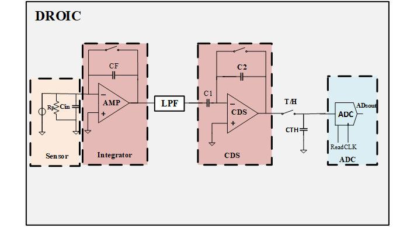
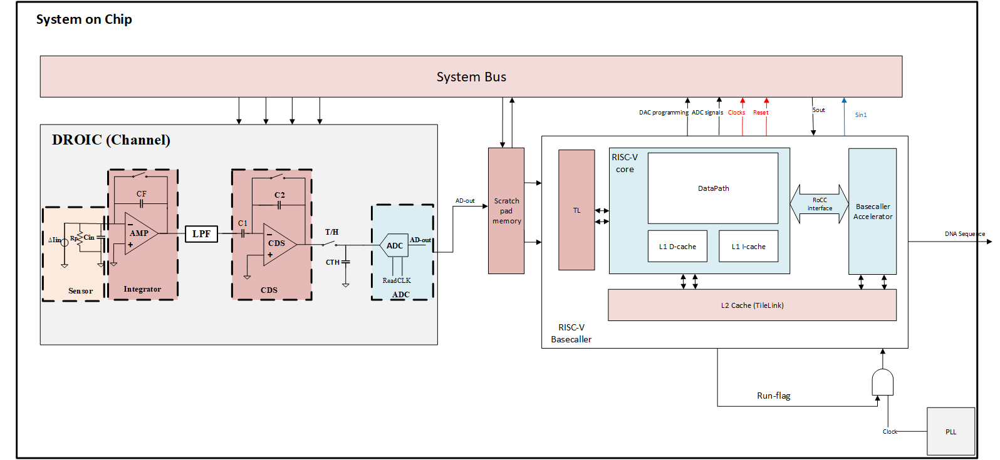
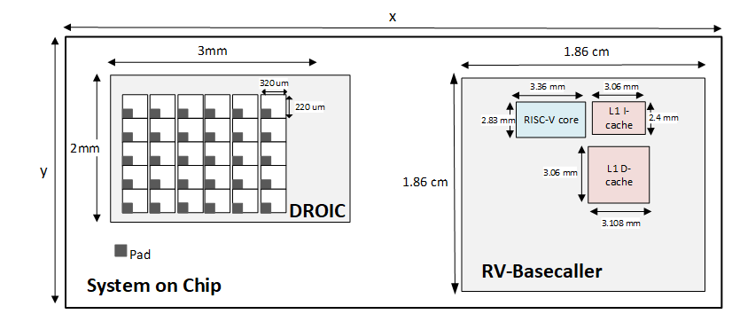
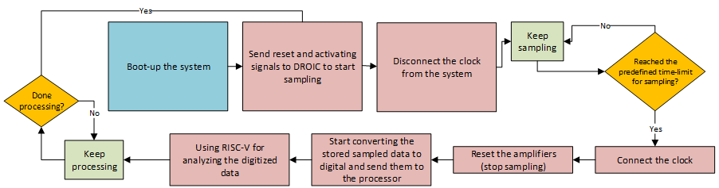

# SensSeq

A <b> low-power and scalable  mixed-signal system on chip for nanopore-based DNA sequencing </b> intended to be integrated for the SSCS Platform for IC Design Outreach (PICO) Open-Source Design Contest.  

Table of contents
==============================
<!--ts-->
  * [Summary](#Summary)
    * [Motivation](#Motivation)
  * [Description](#Description)
    * [Layouts](#Layouts)
    * [Simulation Results](#Simulation-Results)
  * [Team Members](#Team-Members)  
  * [References](#References)
<!--te-->

Summary
=======

This design contains a mixed-signal readout array and a Bioinformatics Processing Unit that:
-  Amplifies the pico-ampere-range current signals
-  Filters high frequecy contents
-  Samples the analog input 
-  Digitizes the samples with SAR ADCs
-  Stores the digital data in a memory
-  Read the memory and analyse the data to identify the DNA sequence 

In order to test an on-chip circuits will be defined to generate the pico-ampere currents. Also a timing technique will be used to seperate the digital and anlaog circuity opertion time.
 
### Motivation

Nanopore-based DNA sequencing is a unique, scalable technology, utilized to identify nucleotides (i.e., A, C, G, T) according to the pico-ampere-sized current fluctuations induced by the passage of a DNA strand through a like-sized molecular sensor (i.e. a “nanopore”).   This approach, a so-called “3rd Generation” sequencing technology, entered the market in 2014, and is, by certain key measures, at least 1000X better than incumbent methods.  For example, its main components fit in the palm of one’s hand (a volumetric footprint about 1000X smaller than established machines) and it has demonstrated the ability to process contiguous DNA strands well in excess of 100,000 nucleotides in length.  
Critical to the success and improvement of nanopore-based DNA sequencing machines are improvements in the semiconductor systems that process the pico-ampere-sized currents that they generate.  There are at least two key parts to this, i) a multi-channel digital readout integrated circuit (DROIC), that amplifies, filters, and digitizes the current measurements from multitudes of arrayed nanopore sensors, and ii) a bioinformatics processing unit (BPU) that processes the gathered data in order to extract biologically relevant information.
In this proposal we endeavor to produce a chip that has both a DROIC and BPU in the same substrate.  The intent of this effort is to introduce a technology that, by virtue of even more aggressive miniaturization will make DNA sequencing more mobile, cheaper, and more applicable to a broader array of applications.

Description
===========

This project introduces a system on chip (SOC) including a high-speed, low-power mixed-signal readout array (the DROIC), and a RISC-V microprocessor (the BPU) for analyzing the readout data. The proposed DROIC system consists of an array of channels, capable of simultaneous amplification, filtering, and digitization of pico-ampere range current signals with sufficient accuracy and speed. Figure 1 depicts the general manner of operation of nanopore-based sequencing (i.e., DNA moves through a nanopore protein and thus induces a small current signature indicative of the DNA’s make-up) and the key DROIC and BPU blocks that enable it.  The novelty of this design is the use of a new readout method in each channel to reduce power consumption compared to the previous works [1], [2], [3] as well as an in-pixel ADC, shown in Figure.2, to overcome substrate and switching noise. 
 

  

 
<h4 align="center">Figure 1. A block diagram of the Nanopore Sensor, Analog and Digital Components.</h4>
   

 
 
<h4 align="center">Figure 2. A simplified block diagram of DROIC[4].</h4>

Since the design includes on-chip ADCs for local digitization, this technique not only minimizes the distance over which analog data needs to be transported, but more importantly, makes the design more flexible for scaling up to hundreds of channels. Moreover, by using low-power, simpler design, the consumed area has been dramatically reduced, a step towards highly integrated arrays and, we anticipate, substantially miniaturized DNA sequencers.
For the implementation of the readout channel, the circuit consists of an integrator with an active filter, a Low-Pass Filter (LPF) which uses a Gm-C filter, and an active Correlated Double Sampling (CDS) for further amplification and noise rejection.

During amplification sequence, the Analog Front-End (AFE)’s output and control signals, have four main phases:
-  Reset (Resetting the amplifiers)
-  Noise sample (A time interval to sample the existing noise before the integration)
-  Integration (A time interval for amplification and noise removal)
-  Readout sample (A time interval at the end of the integration phase to sample the input current) 

Next, samples are converted to their digital equivalent using the local ADCs and then  serially transmitted  to a memory before being fetched by the RISC-V BPU (based on the open-source Rocket architecture) to perform a basecalling algorithm (i.e., conversion of gathered samples to their nucleotide/base text equivalent) on them as depicted in Figure 3.
 
 

    Figure 3.An overview of the proposed system on chip (with only one measurement channel) for DNA sequencing, including Digital Read-Out circuity, a temporal memory and the RISC-V basecaller.

The proposed DROIC, consumes an area of 3×2 mm^2 with 30 parallel-operated channels. The size of each channel is 320×220 〖μm〗^2 in 130-nm CMOS Technology. Besides, the respective chip size of BPU RISC-V core, I$, and D$ cache is about 3.36×2.83 mm^2, 3.06×2.4 mm^2 and 3.108×3.06 mm^2 in 130-nm CMOS.  The DROIC and BPU share approximately 332 I/O pads that their size is 0.3×0.27 mm^2. Figure. 4 illustrates the detailed sizing of the system, touched upon earlier.
  
  

    Figure 4. Layout and sizing of the nanopore array.

### Layouts

#### DROIC

#### RISCV-BPU

---
### Simulation Results

Droic

BPU

### Design Goals
The ultimate goal of this project is to integrate and fabricate the scalable  DROIC and the BPU onto a single  die to perform the DNA sequencing. By doing so, the time-consuming and costly arrangements  for processing, testing and verifying the readout data would be avoided. This  includes several tools and external hardware; hence, there will be a considerable reduction in  costs.
Integrating the RISC-V BPU and the ultra-sensitive discrete-time DROIC amplifiers will be a major contribution to the academia as well as the industry. To achieve this, a semi-sleep processor scheme has been proposed to cope with the noise disturbance of the processor, which will be placed in the far distance from the noise-prone amplifiers.  While the channels are sampling, ADCs and any RISC-V chip need to be quiet. Then, once the channels are sampled and stored in a temporal memory, readout sampling will be stopped and immediately, the clock will become online to  enable the   ADCs to digitize the samples and the RISC-V BPU to determine the order of the four DNA bases, namely, A, C, T and G. The DNA input current sampling step will start again when the processor issues the done signal. This cyclic behavior of the system will be repeated until the complete DNA sequence is identified. Figure. 5. depicts the above process. 

Utilization of this new system will result in immense savings, as the previous methods for off-chip basecalling of the DROIC data requires several intermediate boards and a number of third-party software. In addition to this, due to the integration, there will be a drastic reduction in power dissipation, testing and diagnosing time, compared to the equivalent separate circuits. 
The fabrication of the proposed system will open new doors in future development and design of low-power, scalable DNA sequencing systems.

 
   
 Figure 5. The diagram of a semi-sleep RISC-V processor. 

Team members
============

1.	**Sebastian Magierowski: Team Leader**
  •	Professor, Dept of EECS, York University
2.	**Amin Savari**
  •	PhD Student, Dept of EECS, York University
3.	**Sepideh Asgari**
  •	PhD Student, Dept of EECS, York University

References
==========

1.	Dai, S., et al., A 155-dB dynamic range current measurement front end for electrochemical biosensing. IEEE transactions on biomedical circuits and systems, 2016. 10(5): p. 935-944.
2.	Shekar, S., et al., Measurement of DNA translocation dynamics in a solid-state nanopore at 100 ns temporal resolution. Nano letters, 2016. 16(7): p. 4483-4489.
3.	Taherzadeh-Sani, M., et al., A 170-dB $\Omega $ CMOS TIA With 52-pA Input-Referred Noise and 1-MHz Bandwidth for Very Low Current Sensing. IEEE Transactions on Very Large Scale Integration (VLSI) Systems, 2017. 25(5): p. 1756-1766.
4.	Dawji, Y., et al., A Scalable Discrete-Time Integrated CMOS Readout Array for Nanopore Based DNA Sequencing. IEEE Access, 2021. 9: p. 155543-155554.

